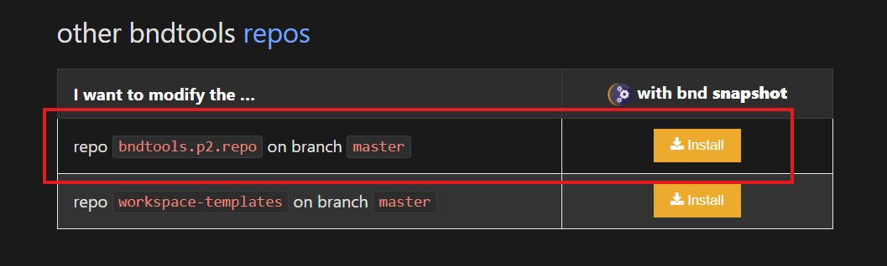
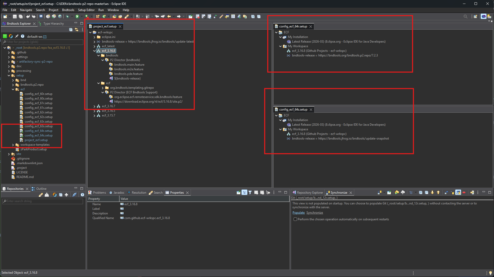
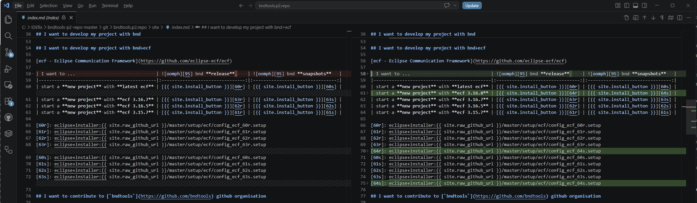
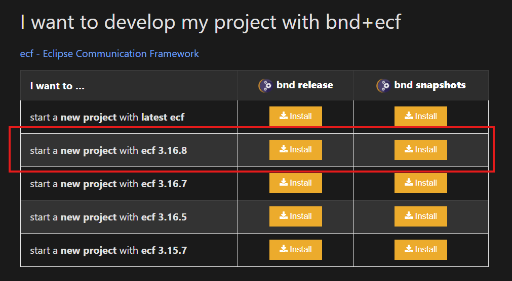

# ECF update process

## Adding new version for ECF

1. Install eclipse for editing repository `https://github.com/bndtools/bndtools.p2.repo/` via 

    https://bndtools.org/bndtools.p2.repo/
    

2. Add the new version into the project file `setup/ecf/project_ecf.setup`
    
    copy an existing version and modify from old to new version
    
    
    duplicate existing `config_ecf_##[r|s].setup` files for new version refs, increase the number
    
    drag the new version into the My Workspace sections and remove the old one

3. Add/Update the oomph landing page `index.md`

    create an entry for the new version

    

    Create a signed commit, push! 
    Wait for [gh action to finish](https://github.com/bndtools/bndtools.p2.repo/actions/workflows/static.yml)
    
    Verify the deployed resul  [oomph setups](https://bndtools.org/bndtools.p2.repo/)

    

    test the updated/changed entries!
